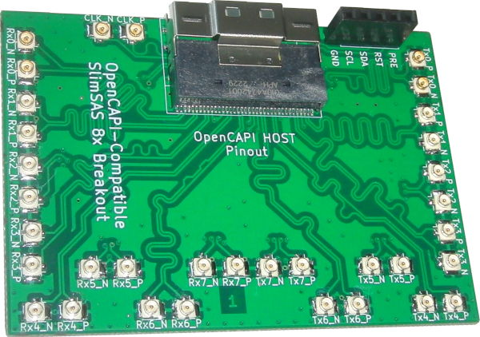
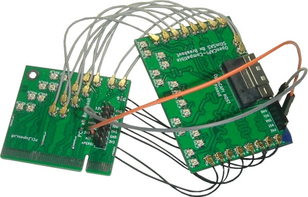
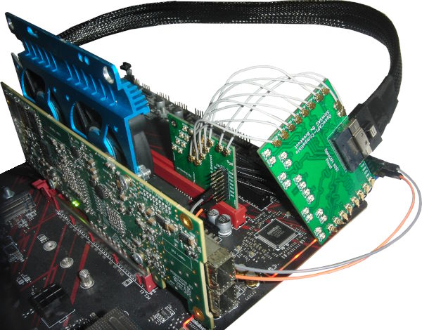
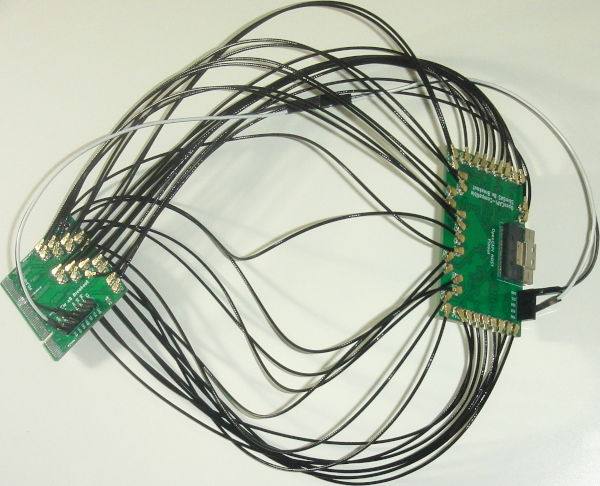
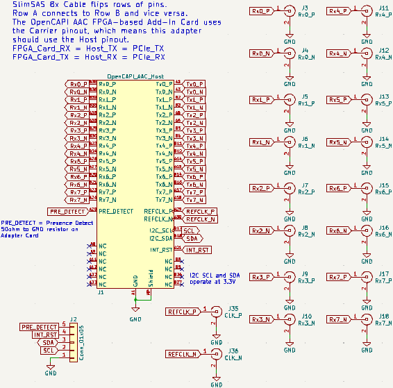

**Work-In-Progress**: [Gerbers produced](https://github.com/mwrnd/SlimSAS8x_Breakout/releases/tag/v0.1-alpha) and being tested.

# OpenCAPI-Compatible SlimSAS 8x Breakout

[OpenCAPI](https://files.openpower.foundation/s/xSQPe6ypoakKQdq/download/25Gbps-spec-20171108.pdf)-compatible SlimSAS 8x to [U.FL/UMCC Connector](https://en.wikipedia.org/wiki/Hirose_U.FL) breakout using a **Host** version of the OpenCAPI **Carrier** pinout from the [ADM-PCIE-9V5 User Manual (Pg15-19of38)](https://www.alpha-data.com/xml/user_manuals/adm-pcie-9v5%20user%20manual_v1_4.pdf).

No consideration was given to compatibility with the [SlimSAS SFF-8654 Standard](https://members.snia.org/document/dl/26744).

# Testing and Use Example

The board is currently being used along with a [PCIe_x8_Breakout](https://github.com/mwrnd/PCIe_x8_Breakout) board to test [OpenCAPI-to-PCIe](https://github.com/mwrnd/innova2_experiments/tree/main/xdma_opencapi) on the [Innova-2 SmartNIC](https://www.nvidia.com/en-us/networking/ethernet/innova-2-flex/). PCIe 3.0 x4 at 8.0GT/s is currently working. Standard [0.1" M-F Jumpers](https://www.digikey.com/en/products/detail/adafruit-industries-llc/1954/6827087) are used for the PCIe Reset Signal (*nPERST*) and its GND.

With cables shorter than 4"~=100mm the [adapters work](https://github.com/mwrnd/innova2_experiments/tree/main/xdma_opencapi). Note the [RX U.FL-to-U.FL cables](https://www.digikey.com/en/products/detail/te-connectivity-amp-connectors/2118651-6/11205742) are all the same length as each other and likewise all [TX cables](https://www.digikey.com/en/products/detail/te-connectivity-amp-connectors/2015698-2/1249186) are the same length but RX and TX are different lengths as that is what I had access to. RX on the PCIe board connects to RX on the OpenCAPI board as it uses the OpenCAPI Host pinout. 

PCIe x4 In-system:

However, using 250mm IPEX cables the adapters fail for PCIe x8:

PCIe x8 In-system:

# PCB Layout

All differential pairs are length-matched to within 1mm both inter-pair and intra-pair.

# Schematic

# PCB Layer Stackup

4-Layer PCB stackup taken from [JLCPCB](https://jlcpcb.com/capabilities/pcb-capabilities).

Differential Impedance parameters were calculated using the [DigiKey Online Calculator](https://www.digikey.com/en/resources/conversion-calculators/conversion-calculator-pcb-trace-impedance).

