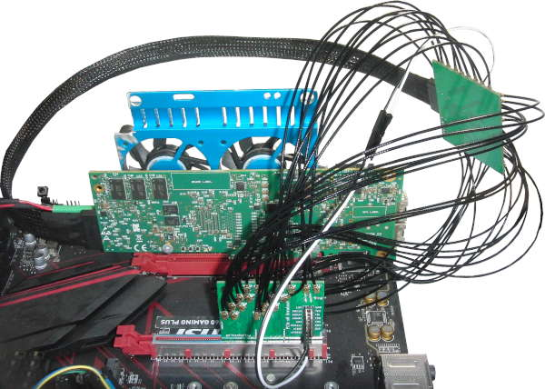

# OpenCAPI Breakout

[OpenCAPI](https://files.openpower.foundation/s/xSQPe6ypoakKQdq/download/25Gbps-spec-20171108.pdf)-compatible SlimSAS 8x to [U.FL/UMCC Connector](https://en.wikipedia.org/wiki/Hirose_U.FL) breakout using a **Host** version of the OpenCAPI **Carrier** pinout from the [ADM-PCIE-9V5 User Manual (Pg15-19of38)](https://www.alpha-data.com/xml/user_manuals/adm-pcie-9v5%20user%20manual_v1_4.pdf). 

I have [successfully tested](https://github.com/mwrnd/innova2_experiments/tree/main/xdma_opencapi) the board using 
 [SlimSAS SFF-8654 8i 85-Ohm Cable](https://www.sfpcables.com/24g-internal-slimsas-sff-8654-to-sff-8654-8i-cable-straight-to-90-degree-left-angle-8x-12-sas-4-0-85-ohm-0-5-1-meter)([Archived](https://web.archive.org/web/20210121175017/https://www.sfpcables.com/24g-internal-slimsas-sff-8654-to-sff-8654-8i-cable-straight-to-90-degree-left-angle-8x-12-sas-4-0-85-ohm-0-5-1-meter)) and [8ES8-1DF21](https://www.3m.com/3M/en_US/p/d/b5000000278/)([Datasheet](https://multimedia.3m.com/mws/media/1398233O/3m-slimline-twin-ax-assembly-sff-8654-x8-30awg-78-5100-2665-8.pdf)) cables.

No consideration was given to compatibility with the [SlimSAS SFF-8654 Standard](https://members.snia.org/document/dl/26744).

The [Open Coherant Accelerator Processor Interface (OpenCAPI)](https://opencapi.org/wp-content/uploads/2022/07/OpenCAPI-Overview.pdf) [was a standard](https://opencapi.org/2022/08/09/cxl-consortium-and-opencapi-consortium-sign-letter-of-intent-to-transfer-opencapi-specifications-to-cxl/) that had FPGA-based [Advanced Accelerated Cable (AAC)](https://files.openpower.foundation/s/xSQPe6ypoakKQdq/download/25Gbps-spec-20171108.pdf) [Add-In cards](https://opencapi.org/wp-content/uploads/2018/12/OpenCAPI-Tech-SC18-Exhibitor-Forum.pdf) such as [ADM-PCIE-9H3](https://www.alpha-data.com/product/adm-pcie-9h3/), [ADM-PCIE-9H7](https://www.alpha-data.com/alpha-data-release-adm-pcie-9h7-data-center-board-with-xilinx-virtex-ultrascale-hbm-fpga/), [ADM-PCIE-9V3](https://www.alpha-data.com/product/adm-pcie-9v3/), [ADM-PCIE-9V5](https://www.alpha-data.com/product/adm-pcie-9v5/), [BittWare XUP-VV4](https://www.bittware.com/fpga/xup-vv4/), [BittWare XUP-VVH](https://www.bittware.com/fpga/xup-vvh/), and [Nvidia Innova-2 Flex](https://www.nvidia.com/en-us/networking/ethernet/innova-2-flex/).

This breakout board uses the OpenCAPI **Host** pinout which is the row A-to-B/B-to-A swapped version of the **Carrier** pinout from the [ADM-PCIE-9V5 User Manual (Pg15-19of38)](https://www.alpha-data.com/xml/user_manuals/adm-pcie-9v5%20user%20manual_v1_4.pdf). SlimSAS cables swap rows. Refer to the [OpenCAPI-to-PCIe project's Schematic](https://github.com/mwrnd/OpenCAPI-to-PCIe#schematic) for notes on using the Innova-2's OpenCAPI port which has a different pinout. The Innova-2 is the only OpenCAPI board I have tested.

Related Projects: [PCIe_x8_Breakout](https://github.com/mwrnd/PCIe_x8_Breakout), [OpenCAPI-to-PCIe](https://github.com/mwrnd/OpenCAPI-to-PCIe), [OpenCAPI-to-PCIe_x4_Host_and_Endpoint](https://github.com/mwrnd/OpenCAPI-to-PCIe_x4_Host_and_Endpoint), [QSFP_Breakout](https://github.com/mwrnd/QSFP_Breakout), [HDMI_Breakout](https://github.com/mwrnd/HDMI_Breakout)

# Testing and Use Example

The board is currently being used along with a [PCIe_x8_Breakout](https://github.com/mwrnd/PCIe_x8_Breakout) board to test [OpenCAPI-to-PCIe](https://github.com/mwrnd/innova2_experiments/tree/main/xdma_opencapi) on the [Innova-2 SmartNIC](https://www.nvidia.com/en-us/networking/ethernet/innova-2-flex/). PCIe 3.0 x4 at 8.0GT/s is currently working. Standard [0.1" M-F Jumpers](https://www.digikey.com/en/products/detail/adafruit-industries-llc/1954/6827087) are used for the PCIe Reset Signal (*nPERST*) and its GND.

With cables shorter than 4"~=100mm the [adapters work](https://github.com/mwrnd/innova2_experiments/tree/main/xdma_opencapi). Note the [RX U.FL-to-U.FL cables](https://www.digikey.com/en/products/detail/te-connectivity-amp-connectors/2118651-6/11205742) are all the same length as each other and likewise all [TX cables](https://www.digikey.com/en/products/detail/te-connectivity-amp-connectors/2015698-2/1249186) are the same length but RX and TX are different lengths as that is what I had access to. RX on the PCIe board connects to RX on the OpenCAPI board as it uses the OpenCAPI Host pinout. 

PCIe x4 In-system:

However, using 250mm IPEX cables the adapters fail for PCIe x8:

PCIe x8 In-system:

# PCB Layout

All differential pairs are length-matched to within 1mm both inter-pair and intra-pair.

The board requires a [U10A474200T](https://www.digikey.com/en/products/detail/amphenol-cs-commercial-products/U10A474200T/14632855)/[U10A474240T](https://www.digikey.com/en/products/detail/amphenol-cs-commercial-products/U10A474240T/17066204) SlimSAS 74-Pin Receptacle, up to 34 [U.FL/UMCC Surface Mount Receptacles](https://www.digikey.com/en/products/detail/te-connectivity-amp-connectors/2337019-1/9974052), and a 5-Pin 2.54mm [Header](https://www.digikey.com/en/products/detail/sullins-connector-solutions/PREC005SAAN-RC/2774849) or [Socket](https://www.digikey.com/en/products/detail/sullins-connector-solutions/PPPC051LFBN-RC/810177).

# Schematic

# PCB Layer Stackup

4-Layer PCB stackup taken from [JLCPCB](https://jlcpcb.com/capabilities/pcb-capabilities).

Differential Impedance parameters were calculated using the [DigiKey Online Calculator](https://www.digikey.com/en/resources/conversion-calculators/conversion-calculator-pcb-trace-impedance).

